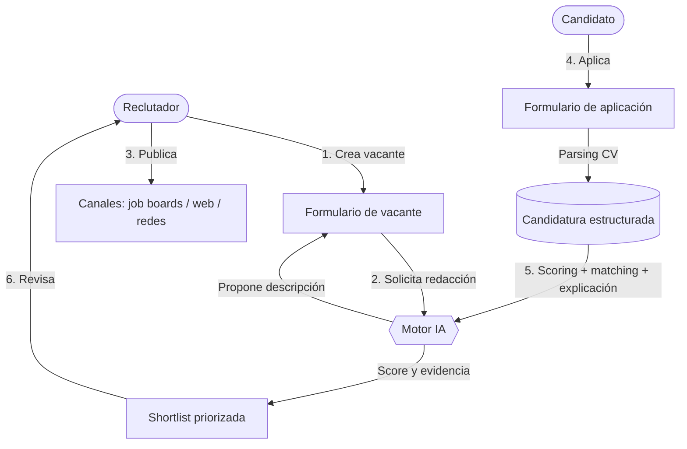
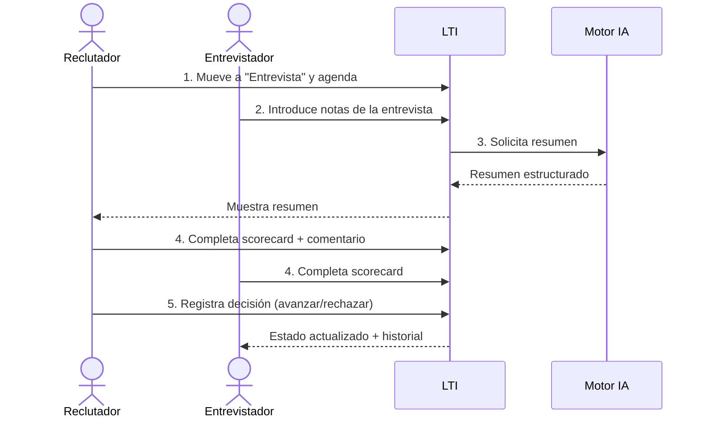
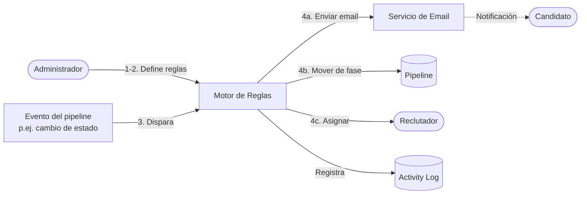
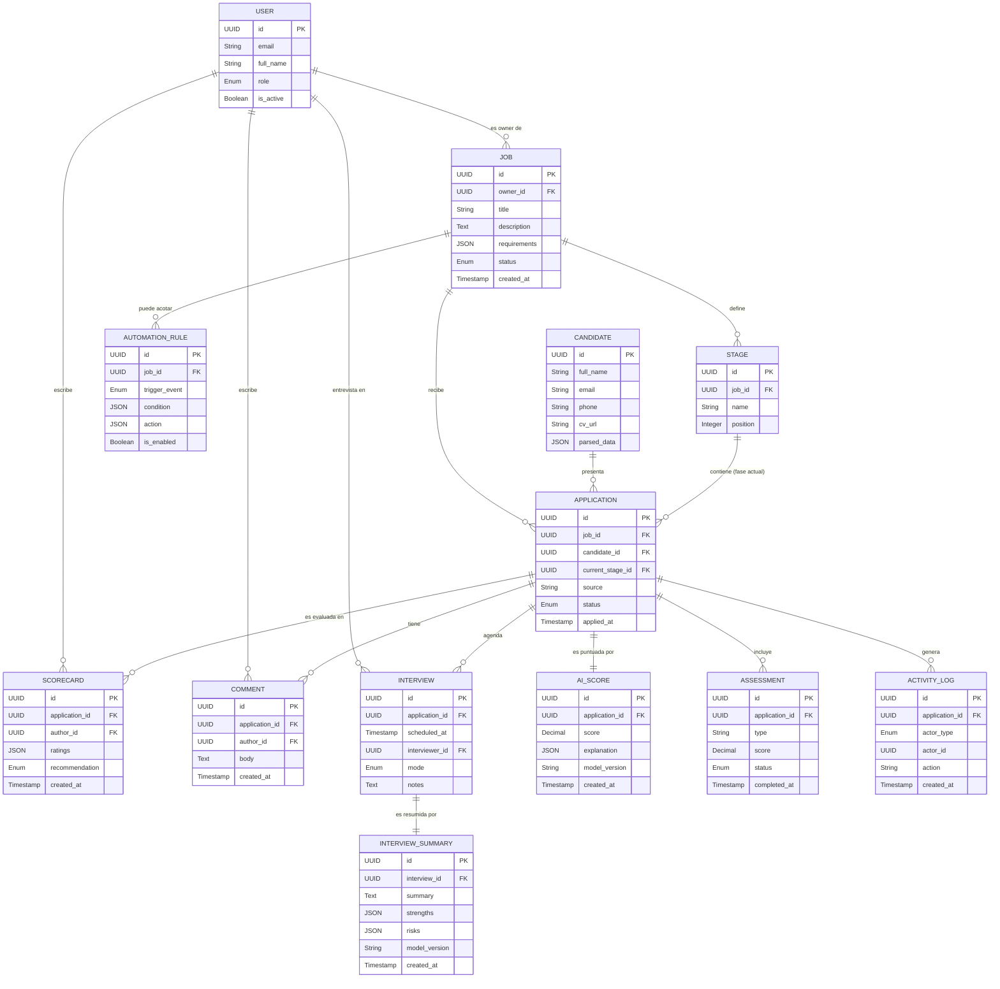
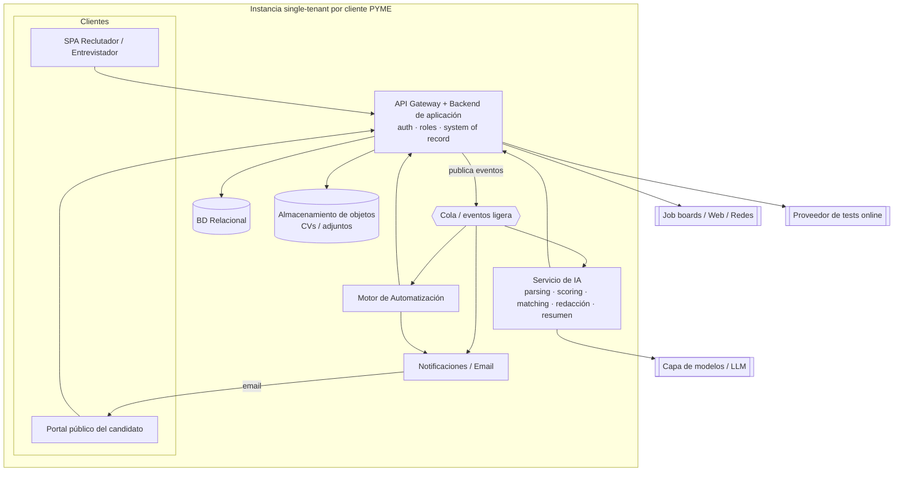
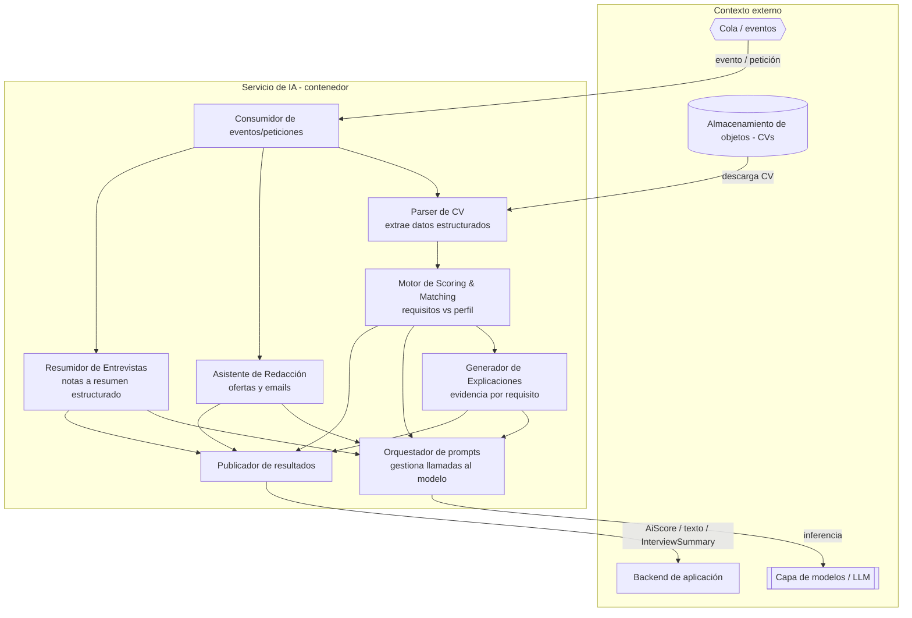

# LTI — Applicant Reference Product (ARP)
### Documento fundacional de producto — Versión 1 (v1)

> **Propósito de este documento.** Servir como base compartida para que ingeniería, diseño, ventas y dirección se alineen antes de construir la v1 de **LTI**, el ATS del futuro. Cada decisión relevante incluye su *por qué*. Es un documento autocontenido.

---

## 0. Decisiones de partida confirmadas

Las siguientes decisiones fueron confirmadas con negocio y condicionan el resto del documento. No son supuestos: son restricciones de diseño de la v1.

| # | Decisión | Valor confirmado | Implicación de diseño |
|---|----------|------------------|------------------------|
| D1 | **Segmento prioritario v1** | **PYMEs (10–200 empleados)** | Modelo de permisos sencillo (pocos roles); con frecuencia una misma persona ejerce de reclutador y *hiring manager*. Pricing bajo y sensible al precio. Casos de uso optimizados para equipos pequeños y *time-to-hire* corto. |
| D2 | **IA imprescindible en v1** | **Las cuatro:** cribado/scoring de CVs, matching candidato-vacante, redacción de ofertas y emails, **y resumen de entrevistas** | La IA es el eje central del valor, no un añadido. Requiere captura de notas/transcripción de entrevista (ver D-riesgo sobre privacidad). |
| D3 | **Modelo de despliegue** | **Single-tenant simple** | Una instancia (y base de datos) por cliente. El modelo de datos **no** lleva `tenant_id`; el aislamiento es físico/por despliegue. Arquitectura más simple, menos servicios, despliegue replicable por cliente. |
| D4 | **Alcance del proceso v1** | Cubre las 7 etapas de `ats.jpg`: crear oferta → publicar → recibir → revisar/cribar → tests online → entrevistas → contratación | Mantiene el producto fiel al material de referencia y garantiza un flujo completo *end-to-end*. |

> **Supuesto residual (S1):** UI en español e inglés en v1. No fue confirmado; se marca como supuesto y es ajustable.
>
> **Riesgo señalado (R1):** el resumen de entrevistas (D2) implica tratar notas o audio de entrevista, lo que añade obligaciones de privacidad (RGPD: consentimiento, conservación). Se asume captura de **notas de texto** introducidas por el entrevistador en v1 —no grabación de audio— para acotar el riesgo. Ajustable.

---

## 1. Visión de producto

### 1.1 Descripción breve

**LTI** es un *Applicant-Tracking System* SaaS, colaborativo y asistido por IA, diseñado para **PYMEs** que digitaliza el ciclo completo de selección —desde la creación de la oferta hasta la contratación— en un único espacio de trabajo. A diferencia de un ATS tradicional, que es esencialmente una base de datos de candidaturas con flujos rígidos, LTI se construye alrededor de dos ideas: **reducir el trabajo manual mediante automatización e IA de alto valor**, y **convertir la selección en un proceso ágil y colaborativo** en lugar de un intercambio de correos y hojas de cálculo. Para una PYME sin un departamento de RR. HH. grande, esto significa contratar mejor sin necesidad de dedicar una persona a tareas administrativas.

### 1.2 Valor añadido y ventajas competitivas

Las ventajas se formulan de forma específica frente a la categoría, no genérica, y enfocadas al segmento PYME:

1. **IA de extremo a extremo, no solo un filtro.** LTI asiste en las cuatro fases de mayor coste manual: redacta la oferta, criba y puntúa los CV de forma explicable, hace *matching* candidato-vacante y **resume las entrevistas** a partir de las notas del entrevistador. Diferencia frente a ATS que solo filtran por palabras clave o limitan la IA a una única tarea.
2. **Cribado y scoring explicable (no caja negra).** El motor puntúa cada candidatura frente a los requisitos y **muestra el porqué** (qué cumple, qué no, evidencia del CV). Crítico para la confianza y para el cumplimiento en selección.
3. **Pensado para equipos pequeños.** Roles y permisos simples, sin configuración pesada; una persona puede operar todo el proceso. Diferencia frente a suites Enterprise sobredimensionadas y caras para una PYME.
4. **Automatización por reglas configurable sin ingeniería.** El equipo define disparadores ("cuando una candidatura entra en estado X → enviar email Y / mover a fase Z"), reduciendo el trabajo repetitivo que en una PYME recae en pocas manos.
5. **Un único *system of record* con analítica de embudo.** Toda la actividad vive en LTI con trazabilidad, habilitando métricas fiables (*time-to-hire*, conversión por fase, fuente más efectiva) sin montar hojas de cálculo.

### 1.3 Funciones principales (v1)

- **Gestión de vacantes (Jobs):** crear, editar y versionar ofertas; redacción asistida por IA; multi-publicación a job boards/web/redes.
- **Captación de candidaturas:** formulario público de aplicación, *parsing* automático de CV a campos estructurados.
- **Pipeline configurable (Kanban):** fases personalizables por vacante; arrastrar y soltar; reglas de automatización.
- **IA de selección (4 capacidades):** scoring explicable, matching candidato↔vacante, redacción de ofertas/emails y **resumen de entrevistas** a partir de notas.
- **Evaluación colaborativa:** *scorecards*, comentarios y notificaciones.
- **Tests online:** asignación, envío y registro de resultados.
- **Agenda de entrevistas:** programación con notificaciones y captura de notas.
- **Comunicación:** plantillas y envío de emails al candidato (con automatización).
- **Analítica de embudo:** panel con métricas del proceso.
- **Administración:** usuarios, roles simples y configuración.

### 1.4 Lean Canvas

> Mermaid no dispone de plantilla nativa de Lean Canvas; se representa como tabla estructurada (versionable y renderizable), tal como permite el enunciado.

| **Problema** | **Solución** | **Propuesta de valor única** | **Ventaja injusta** | **Segmentos de cliente** |
|---|---|---|---|---|
| 1. En una PYME, pocas personas absorben todo el trabajo manual de selección (cribado, emails, agenda, notas de entrevista). 2. Decisión y seguimiento fragmentados en email/Excel. 3. Sin métricas fiables del embudo. | 1. IA en las 4 fases clave (redacción, cribado explicable, matching, resumen de entrevista). 2. Pipeline colaborativo simple. 3. Automatización por reglas. 4. *System of record* con analítica. | **"El ATS con IA de principio a fin, simple y asequible, hecho para que una PYME contrate como un gran equipo de RR. HH."** | Cobertura de IA **end-to-end + explicable** combinada con una experiencia deliberadamente simple para equipos pequeños; difícil de igualar para suites Enterprise pesadas o para herramientas de IA de una sola tarea. | **PYMEs (10–200 empleados)** *(D1)*. Usuarios: reclutador/responsable de contratación (a menudo la misma persona), administrador, entrevistadores ocasionales. |
| **Métricas clave** | | **Canales** | | |
| *Time-to-hire*, candidaturas procesadas por usuario/semana, % cribado automatizado, adopción de automatizaciones y de resumen de entrevistas, conversión por fase. | | *Inbound* (SEO/contenido para PYMEs), *self-service sign-up*, marketplaces de software para pymes, *referrals*, integraciones con job boards como adquisición. | | |
| **Estructura de costes** | | | **Fuentes de ingreso** | |
| Infraestructura cloud (instancias single-tenant), coste de inferencia de IA, equipo de producto/ingeniería, soporte, cumplimiento (RGPD). | | | **SaaS por suscripción** con tramos asequibles (por usuario y/o por vacantes activas); planes mensuales pensados para PYME. | |

---

## 2. Casos de uso

Se eligen los 3 que mejor reflejan el valor central: **eficiencia + IA end-to-end** (CU-1), **colaboración** que en PYME incluye el resumen de entrevista (CU-2) y **automatización** (CU-3).

### CU-1 — Publicar una vacante y cribar candidaturas con IA

- **Actores:** Reclutador (principal), Candidato (secundario), Motor de IA (sistema).
- **Objetivo:** Publicar una oferta con mínimo esfuerzo y obtener una *shortlist* priorizada automáticamente.
- **Flujo principal:**
  1. El reclutador crea una vacante e introduce datos básicos (título, requisitos clave).
  2. La IA propone una descripción de oferta; el reclutador la edita y aprueba.
  3. Publica la vacante en los canales seleccionados (job boards/web/redes).
  4. Los candidatos aplican; el sistema hace *parsing* del CV a campos estructurados.
  5. El motor de IA puntúa cada candidatura frente a los requisitos (matching) y genera la explicación.
  6. El reclutador ve la lista ordenada por score con el detalle del *porqué*.
- **Resultado esperado:** *Shortlist* priorizada y explicada, con el tiempo de publicación y cribado drásticamente reducido —clave para una PYME con poco personal.

### CU-2 — Entrevistar, resumir con IA y decidir de forma colaborativa

- **Actores:** Reclutador, Entrevistador (pueden ser la misma persona en una PYME), Motor de IA (sistema).
- **Objetivo:** Capturar la entrevista, obtener un resumen automático y decidir sobre el candidato sin salir de la herramienta.
- **Flujo principal:**
  1. El reclutador mueve al candidato a la fase "Entrevista" y la agenda.
  2. Tras la entrevista, el entrevistador introduce sus **notas** en LTI.
  3. La IA genera un **resumen estructurado** de la entrevista (fortalezas, riesgos, encaje con requisitos).
  4. El/los evaluadores completan un *scorecard* y comentan; los cambios se reflejan en el registro.
  5. Se toma una decisión (avanzar / rechazar) que queda registrada con autor y fecha.
- **Resultado esperado:** Decisión trazable y basada en criterios comunes, con el resumen de IA ahorrando el trabajo de ordenar notas —especialmente útil cuando una sola persona lleva varios procesos.

### CU-3 — Automatización de comunicaciones y avance de fase por reglas

- **Actores:** Administrador (configura), Reclutador (opera), Sistema de reglas (ejecuta).
- **Objetivo:** Eliminar acciones repetitivas mediante reglas disparadas por eventos.
- **Flujo principal:**
  1. El administrador define una regla: *"cuando una candidatura entra en estado RECHAZADA → enviar email de plantilla X"*.
  2. Define otra: *"cuando los resultados de un test ≥ umbral → mover a fase Entrevista y asignar al reclutador"*.
  3. Durante la operación, los eventos del pipeline disparan las reglas automáticamente.
  4. El motor ejecuta la acción (email / cambio de fase / asignación) y registra la actividad.
  5. El reclutador solo atiende las excepciones que requieren intervención humana.
- **Resultado esperado:** Menos tareas manuales y comunicación consistente, con registro auditable de cada acción automática.

---

## 3. Modelo de datos

Entidades, atributos (nombre y tipo) y relaciones. Coherente con los 3 casos de uso y con las 4 capacidades de IA (incluye `InterviewSummary`). Al ser **single-tenant** *(D3)*, **no hay `tenant_id`**: cada cliente tiene su propia instancia y base de datos; el aislamiento es por despliegue.

### 3.1 Entidades y atributos

**User** — usuario del sistema. En PYME los roles son pocos y una persona puede combinar funciones.
| Atributo | Tipo |
|---|---|
| id (PK) | UUID |
| email | String |
| full_name | String |
| role | Enum (ADMIN, RECRUITER, INTERVIEWER) |
| is_active | Boolean |

**Job** — vacante.
| Atributo | Tipo |
|---|---|
| id (PK) | UUID |
| owner_id (FK→User) | UUID |
| title | String |
| description | Text |
| requirements | JSON |
| status | Enum (DRAFT, OPEN, CLOSED) |
| created_at | Timestamp |

**Stage** — fase del pipeline (configurable por vacante).
| Atributo | Tipo |
|---|---|
| id (PK) | UUID |
| job_id (FK) | UUID |
| name | String |
| position | Integer |

**Candidate** — persona candidata.
| Atributo | Tipo |
|---|---|
| id (PK) | UUID |
| full_name | String |
| email | String |
| phone | String |
| cv_url | String |
| parsed_data | JSON |

**Application** — candidatura (Candidate aplica a Job).
| Atributo | Tipo |
|---|---|
| id (PK) | UUID |
| job_id (FK) | UUID |
| candidate_id (FK) | UUID |
| current_stage_id (FK→Stage) | UUID |
| source | String |
| status | Enum (ACTIVE, HIRED, REJECTED, WITHDRAWN) |
| applied_at | Timestamp |

**AiScore** — resultado del cribado/matching IA para una candidatura.
| Atributo | Tipo |
|---|---|
| id (PK) | UUID |
| application_id (FK) | UUID |
| score | Decimal |
| explanation | JSON |
| model_version | String |
| created_at | Timestamp |

**Scorecard** — evaluación de un usuario sobre una candidatura.
| Atributo | Tipo |
|---|---|
| id (PK) | UUID |
| application_id (FK) | UUID |
| author_id (FK→User) | UUID |
| ratings | JSON |
| recommendation | Enum (YES, NO, MAYBE) |
| created_at | Timestamp |

**Comment** — comentario colaborativo sobre una candidatura.
| Atributo | Tipo |
|---|---|
| id (PK) | UUID |
| application_id (FK) | UUID |
| author_id (FK→User) | UUID |
| body | Text |
| created_at | Timestamp |

**Assessment** — test online asignado a una candidatura.
| Atributo | Tipo |
|---|---|
| id (PK) | UUID |
| application_id (FK) | UUID |
| type | String |
| score | Decimal |
| status | Enum (ASSIGNED, COMPLETED, EXPIRED) |
| completed_at | Timestamp |

**Interview** — entrevista programada.
| Atributo | Tipo |
|---|---|
| id (PK) | UUID |
| application_id (FK) | UUID |
| scheduled_at | Timestamp |
| interviewer_id (FK→User) | UUID |
| mode | Enum (ONSITE, REMOTE) |
| notes | Text |

**InterviewSummary** — resumen generado por IA a partir de las notas de una entrevista *(soporta D2)*.
| Atributo | Tipo |
|---|---|
| id (PK) | UUID |
| interview_id (FK) | UUID |
| summary | Text |
| strengths | JSON |
| risks | JSON |
| model_version | String |
| created_at | Timestamp |

**AutomationRule** — regla de automatización por eventos.
| Atributo | Tipo |
|---|---|
| id (PK) | UUID |
| job_id (FK, nullable) | UUID |
| trigger_event | Enum |
| condition | JSON |
| action | JSON |
| is_enabled | Boolean |

**ActivityLog** — registro de actividad/auditoría.
| Atributo | Tipo |
|---|---|
| id (PK) | UUID |
| application_id (FK, nullable) | UUID |
| actor_type | Enum (USER, SYSTEM) |
| actor_id | UUID |
| action | String |
| created_at | Timestamp |

### 3.2 Diagrama entidad-relación

---

## 4. Diseño del sistema a alto nivel

### 4.1 Componentes y cómo interactúan

LTI v1 se despliega en modo **single-tenant** *(D3)*: cada cliente PYME tiene su propia instancia de la aplicación y su propia base de datos, lo que simplifica el aislamiento (es físico, no lógico) y reduce la complejidad operativa inicial. Dentro de cada instancia, la arquitectura separa el plano síncrono (peticiones de usuario) del asíncrono (IA y automatización), porque las tareas de IA —cribado y, sobre todo, resumen de entrevistas— no deben bloquear la interfaz.

- **Clientes (SPA web):** aplicación del reclutador/entrevistador y portal público de aplicación del candidato.
- **API Gateway / Backend de aplicación:** punto de entrada; autentica, autoriza por rol (modelo simple) y contiene la lógica de negocio (vacantes, candidaturas, pipeline, scorecards, comentarios, entrevistas). Es el *system of record* y publica eventos de dominio cuando algo cambia.
- **Servicio de IA:** consume eventos y peticiones para las cuatro capacidades —*parsing* de CV, scoring/matching con explicación, redacción de ofertas/emails y resumen de entrevistas a partir de notas— apoyándose en una capa de modelos.
- **Motor de Automatización (Reglas):** escucha eventos de dominio, evalúa condiciones y ejecuta acciones (email, cambio de fase, asignación) — corazón del CU-3.
- **Servicio de Notificaciones/Email:** envío transaccional al candidato y notificaciones internas.
- **Cola / eventos (ligera):** desacopla las tareas de IA y de reglas del flujo de petición; en single-tenant puede ser una cola embebida o un servicio gestionado simple, sin la complejidad de un bus multi-tenant.
- **Persistencia:** base de datos relacional (modelo de la sección 3) y almacenamiento de objetos para CVs/adjuntos, por instancia de cliente.
- **Integraciones externas:** job boards / web / redes para multi-publicación (etapa 2 de `ats.jpg`); proveedores de tests online; capa de modelos / LLM.

### 4.2 Diagrama de arquitectura de alto nivel

---

## 5. Diagrama C4 en profundidad

### 5.1 Componente elegido y justificación

Se profundiza en el **Servicio de IA**. Motivo: concentra las cuatro capacidades que constituyen la propuesta de valor confirmada *(D2)* —incluido el nuevo **resumen de entrevistas**—, es el componente de mayor complejidad y riesgo técnico (latencia, coste de inferencia, calidad y auditabilidad de las explicaciones, y tratamiento de notas de entrevista con implicaciones de privacidad, R1) y el que más determina la confianza de la PYME en el producto. Documentarlo bien reduce el mayor foco de incertidumbre de la v1.

Se usa el **nivel 3 de C4 (diagrama de componentes)** sobre el Servicio de IA.

### 5.2 Diagrama C4 — Componentes del Servicio de IA

### 5.3 Notas de diseño del Servicio de IA

- **Asíncrono por diseño:** se activa por eventos/peticiones a través de la cola, de modo que un pico de candidaturas o un resumen de entrevista no degradan la experiencia interactiva.
- **Cobertura end-to-end:** un único contenedor sirve las cuatro capacidades (parsing/scoring, matching, redacción y resumen), compartiendo el orquestador de prompts para controlar coste y latencia.
- **Explicabilidad como requisito de primera clase:** el `Generador de Explicaciones` produce evidencia por requisito que se persiste en `AiScore.explanation`; el `Resumidor` persiste en `InterviewSummary`. Ambos guardan `model_version` para trazabilidad.
- **Privacidad (R1):** las notas de entrevista son datos sensibles; al ser single-tenant, no salen de la instancia del cliente salvo la llamada de inferencia, lo que simplifica el cumplimiento RGPD.
- **Orquestador desacoplado de la capa de modelos:** permite cambiar de proveedor/modelo sin tocar la lógica de negocio.

---

## 6. Autoevaluación (criterios de calidad)

- [x] **Ventajas competitivas específicas:** IA end-to-end (4 capacidades), scoring *explicable*, simplicidad para PYME, automatización configurable — no genéricas.
- [x] **3 casos de uso reflejan el valor central:** eficiencia+IA (CU-1), colaboración con resumen de entrevista (CU-2), automatización (CU-3).
- [x] **Modelo de datos coherente con los casos de uso y con D2:** `AiScore` (CU-1), `Scorecard`/`Comment`/`InterviewSummary` (CU-2), `AutomationRule`/`ActivityLog` (CU-3). Sin `tenant_id`, coherente con single-tenant (D3).
- [x] **Arquitectura y C4 consistentes:** el C4 profundiza exactamente en el `Servicio de IA` del diagrama de alto nivel, incluyendo el resumidor de entrevistas.
- [x] **Diagramas informativos, no decorativos:** cada uno aporta actores, flujos o estructura concretos.
- [x] **Documento autocontenido:** incluye decisiones confirmadas, supuesto/riesgo residuales explícitos, justificaciones y referencia a `ats.jpg`.

---

*Documento sujeto a revisión. El supuesto S1 (idiomas) y el riesgo R1 (tratamiento de notas de entrevista) deben confirmarse con negocio/legal antes de iniciar la construcción.*